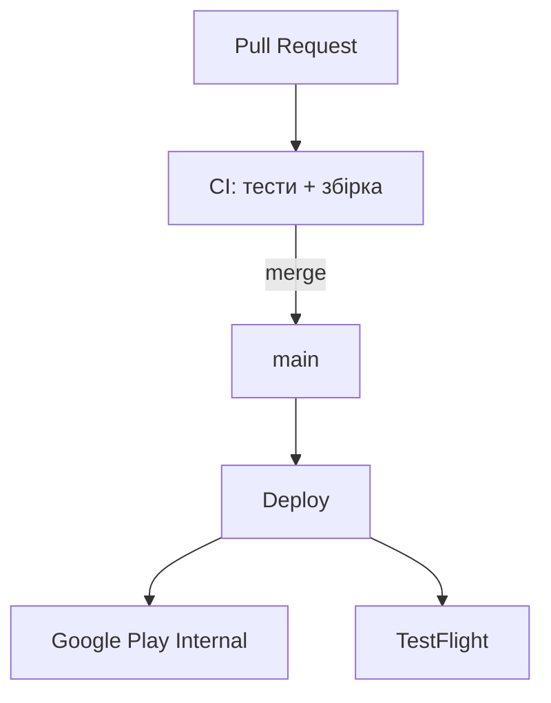

# Fastlane CI/CD Demo

Шаблон Flutter-проєкту з автоматичним деплоєм після merge в `main`.

| Платформа | Auto-deploy (main) | Production (вручну) |
|-----------|-------------------|---------------------|
| Android | Google Play **Internal** | CD Android workflow |
| iOS | **TestFlight** | CD iOS workflow |

---

## Швидкий старт для колег

**Повна покрокова інструкція:** [SETUP.md](./SETUP.md)

Коротко:

1. Скопіювати шаблон / додати `.github/` + fastlane
2. Змінити Bundle ID у всіх місцях (див. SETUP.md → Крок 2)
3. Додати GitHub Secrets (Android × 5, iOS × 8)
4. Локально: `bundle exec fastlane match appstore` (iOS, один раз)
5. Push в `main` → деплой стартує сам

---

## Як це працює



| Workflow | Коли | Що робить |
|----------|------|-----------|
| **CI** | Pull Request | analyze, test, AAB + iOS smoke build |
| **Deploy** | push/merge в `main` | Google Play Internal + TestFlight |
| **CD Android / CD iOS** | вручну | Production |

---

## Версіонування

Перед кожним деплоєм збільшуйте build number:

```yaml
# pubspec.yaml
version: 1.0.1+10
```

---

## Локально

```bash
flutter pub get
bundle install
```

```bash
cd android && bundle exec fastlane build    # AAB
cd ios     && bundle exec fastlane build_ci # iOS без підпису
```

---

## Посилання

- [SETUP.md — інструкція для колег](./SETUP.md)
- [Fastlane docs](https://docs.fastlane.tools/)
- [Flutter deployment](https://docs.flutter.dev/deployment)
