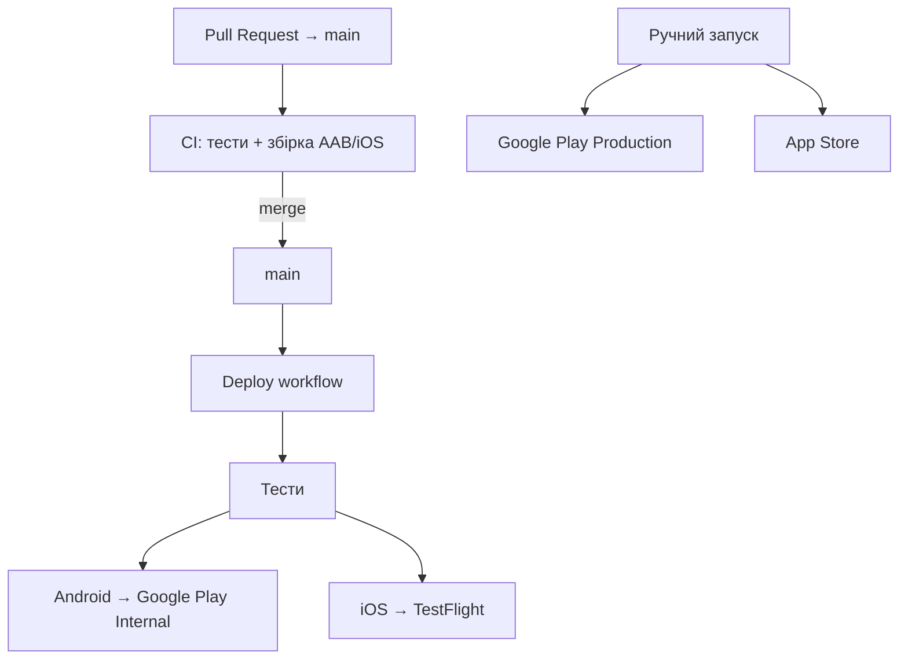

# Fastlane CI/CD Demo

Шаблонний Flutter-проєкт з **Fastlane** та **GitHub Actions**: автоматичний деплой після merge в `main`.

## Як це працює



| Workflow | Коли запускається | Що робить |
|----------|-------------------|-----------|
| **CI** (`ci.yml`) | Pull Request до `main` / `develop` | `analyze`, `test`, збірка AAB + iOS smoke build |
| **Deploy** (`deploy.yml`) | **Кожен push/merge в `main`** | Тести → **Google Play Internal** + **TestFlight** |
| **CD Android** (`cd-android.yml`) | Вручну (Run workflow) | Production у Google Play |
| **CD iOS** (`cd-ios.yml`) | Вручну (Run workflow) | Production у App Store |

> **APK vs AAB:** Google Play приймає лише **AAB** (Android App Bundle) з серпня 2021. APK залишається для локального тестування, але не для магазину.

---

## Покрокове налаштування CD

### Крок 0. GitHub репозиторій

```bash
git remote add origin https://github.com/<org>/<repo>.git
git commit -m "Initial Flutter template with auto-deploy CI/CD"
git push -u origin main
```

Створи **Environment** `production`: GitHub → Settings → Environments → New environment → `production`.

---

### Крок 1. Android — Google Play

#### 1.1 Створи додаток у Play Console

1. [Google Play Console](https://play.google.com/console) → Create app
2. `applicationId` має збігатися з проєктом: `com.fastline.ci`  
   (або зміни в `android/app/build.gradle.kts` і `android/fastlane/Appfile`)

#### 1.2 Створи upload keystore

```bash
keytool -genkey -v \
  -keystore upload-keystore.jks \
  -keyalg RSA -keysize 2048 -validity 10000 \
  -alias upload
```

Збережи файл і паролі — **втрата keystore = неможливість оновлювати додаток**.

#### 1.3 Service Account для Google Play API

1. [Google Cloud Console](https://console.cloud.google.com/) → IAM → Service Accounts → Create
2. Створи JSON ключ для service account
3. Play Console → Setup → API access → Link project → надай service account права **Release manager**

#### 1.4 Додай GitHub Secrets (Android)

GitHub → Settings → Secrets and variables → Actions:

| Secret | Як отримати |
|--------|-------------|
| `ANDROID_KEYSTORE_BASE64` | `base64 -i upload-keystore.jks \| pbcopy` |
| `ANDROID_KEYSTORE_PASSWORD` | пароль keystore |
| `ANDROID_KEY_ALIAS` | `upload` |
| `ANDROID_KEY_PASSWORD` | пароль ключа |
| `GOOGLE_PLAY_JSON_KEY_BASE64` | `base64 -i google-play-key.json \| pbcopy` |

---

### Крок 2. iOS — App Store Connect

#### 2.1 Створи додаток у App Store Connect

1. [App Store Connect](https://appstoreconnect.apple.com) → Apps → New App
2. Bundle ID: `com.fastline.ci` (має збігатися з Xcode + `ios/fastlane/Appfile`)

#### 2.2 App Store Connect API Key

1. App Store Connect → Users and Access → Integrations → **App Store Connect API**
2. Generate API Key (роль Admin або App Manager)
3. Завантаж `.p8` файл, запиши **Key ID** і **Issuer ID**

#### 2.3 Code signing через match (рекомендовано)

Match зберігає сертифікати в окремому git-репозиторії:

```bash
# 1. Створи приватний repo на GitHub, напр. my-org/ios-certificates
cd ios
bundle exec fastlane match init
# вкажи URL репо

# 2. Згенеруй сертифікати (один раз локально)
bundle exec fastlane match appstore
```

#### 2.4 Додай GitHub Secrets (iOS)

| Secret | Значення |
|--------|----------|
| `APP_STORE_CONNECT_API_KEY_BASE64` | `base64 -i AuthKey_XXXXX.p8 \| pbcopy` |
| `APP_STORE_CONNECT_KEY_ID` | Key ID з App Store Connect |
| `APP_STORE_CONNECT_ISSUER_ID` | Issuer ID |
| `APPLE_ID` | твій Apple ID email |
| `APPLE_TEAM_ID` | Team ID (developer.apple.com → Membership) |
| `MATCH_GIT_URL` | `git@github.com:org/ios-certificates.git` |
| `MATCH_PASSWORD` | пароль для шифрування сертифікатів у match repo |
| `MATCH_SSH_PRIVATE_KEY` | SSH ключ з доступом до match repo (Deploy keys) |

---

### Крок 3. Перший автоматичний деплой

1. Переконайся, що всі секрети додані
2. Зроби commit і **merge в `main`**
3. GitHub → Actions → workflow **Deploy**:
   - `Deploy Android (Internal)` → Google Play Internal track
   - `Deploy iOS (TestFlight)` → TestFlight

Після merge **нічого натискати не потрібно** — деплой стартує сам.

---

### Крок 4. Production (вручну)

Коли beta протестовано:

- **Actions → CD Android (Production) → Run workflow** → Google Play Production
- **Actions → CD iOS (Production) → Run workflow** → App Store

---

## Версіонування

Перед кожним новим деплоєм **збільш `version` у `pubspec.yaml`**:

```yaml
version: 1.0.1+2   # 1.0.1 = versionName, 2 = versionCode/build number
```

Google Play і TestFlight **відхилять** білд, якщо `versionCode` / `CFBundleVersion` не більший за попередній.

---

## Локальний запуск

```bash
flutter pub get
bundle install
```

**Android** (`android/`):

```bash
bundle exec fastlane build    # AAB
bundle exec fastlane beta     # Google Play Internal (локально, з key.properties)
```

**iOS** (`ios/`):

```bash
bundle exec fastlane build_ci   # без підпису
bundle exec fastlane beta       # TestFlight (потрібен match + API key)
```

Локальний `key.properties`:

```bash
cp android/key.properties.example android/key.properties
# відредагуй значення
```

---

## Структура проєкту

```
.github/
├── workflows/
│   ├── ci.yml              # PR: тести + збірка
│   ├── deploy.yml          # main: auto-deploy Internal + TestFlight
│   ├── cd-android.yml      # ручний Production (Android)
│   └── cd-ios.yml          # ручний Production (iOS)
└── actions/
    ├── setup-android-signing/
    └── setup-app-store-connect/
android/fastlane/           # Fastlane lanes для Android
ios/fastlane/               # Fastlane lanes для iOS
```

## Корисні посилання

- [Fastlane docs](https://docs.fastlane.tools/)
- [Flutter deployment](https://docs.flutter.dev/deployment)
- [Google Play AAB requirement](https://developer.android.com/guide/app-bundle)
